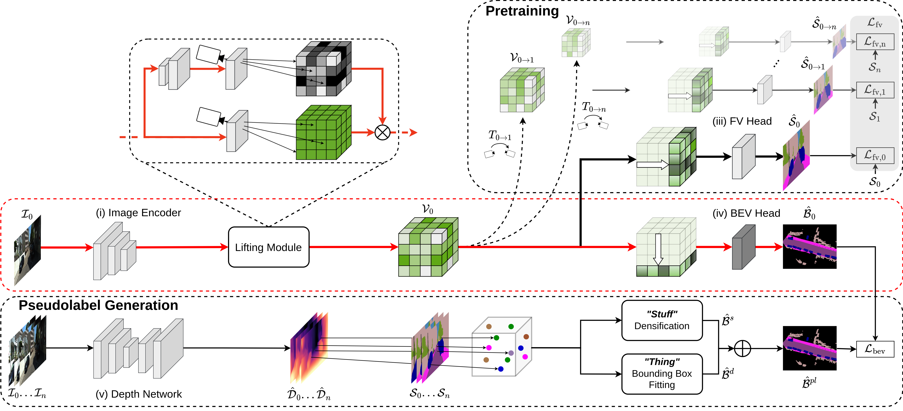

# SkyEye: Self-Supervised Bird's-Eye-View Semantic Mapping Using Monocular Frontal View Images

This repository contains the PyTorch implementation of the SkyEye model proposed in our CVPR 2023 paper [SkyEye: Self-Supervised Bird's-Eye-View Semantic Mapping Using Monocular Frontal View Images](https://openaccess.thecvf.com/content/CVPR2023/html/Gosala_SkyEye_Self-Supervised_Birds-Eye-View_Semantic_Mapping_Using_Monocular_Frontal_View_Images_CVPR_2023_paper.html).



If you find this code useful for your research, please consider citing our paper:
```
@InProceedings{Gosala_2023_CVPR,
author={Gosala, Nikhil and Petek, K\"ursat and Drews-Jr, Paulo L. J. and Burgard, Wolfram and Valada, Abhinav},
title={SkyEye: Self-Supervised Bird's-Eye-View Semantic Mapping Using Monocular Frontal View Images},
booktitle={Proceedings of the IEEE/CVF Conference on Computer Vision and Pattern Recognition (CVPR)},
month={June},
year={2023},
pages={14901-14910}}
```

## Relevant links
- [Paper (CVF)](https://openaccess.thecvf.com/content/CVPR2023/html/Gosala_SkyEye_Self-Supervised_Birds-Eye-View_Semantic_Mapping_Using_Monocular_Frontal_View_Images_CVPR_2023_paper.html)
- [Paper (arXiv)](https://arxiv.org/abs/2302.04233)
- [Video](https://www.youtube.com/watch?v=PGne5XG4f_8)
- [Project Webpage](http://skyeye.cs.uni-freiburg.de//)

## System requirements
- Linux (Tested on Ubuntu 20.04)
- Python3 (Tested using Python 3.8 and 3.10)
- PyTorch (Tested using PyTorch 1.13.1)
- CUDA (Tested using CUDA 11.7)

## Installation
a. Create a python virtual environment and activate it.
```shell
python3 -m venv skyeye
source skyeye/bin/activate
```
b. Update `pip` to the latest version.
```shell
python3 -m pip install --upgrade pip
```
c. Install PyTorch 1.13.1 for CUDA 11.7.
```shell
pip install torch==1.13.1+cu117 torchvision==0.14.1+cu117 torchaudio==0.13.1 --extra-index-url https://download.pytorch.org/whl/cu117
```
c. Install InPlaceABN by following the steps outlined in their [GitHub repo](https://github.com/mapillary/inplace_abn?tab=readme-ov-file#requirements).

d. Install the other python dependencies using the provided `requirements.txt` file.
```shell
pip3 install -r requirements.txt
```
d. Install the SkyEye code.
```shell
python3 setup.py develop
```

## SkyEye datasets
### KITTI-360
- Download the Kitti-360 dataset from [here](http://www.cvlibs.net/datasets/kitti-360/).
- Download the Kitti-360 BEV dataset from [here](http://skyeye.cs.uni-freiburg.de/#dataset).
- In the training and evaluation scripts:
  - Modify the `dataset_root_dir` parameter to point to the location of the original Kitti-360 dataset.
  - Modify the `seam_root_dir` parameter to point to the location of the Kitti-360 PanopticBEV dataset.

## Code execution

### Configuration parameters
The configuration parameters of the model such as the learning rate, batch size, and dataloader options are stored in the `experiments/config` folder.
If you intend to modify the model parameters, please do so here.

### Training and evaluation
The training and evaluation python codes along with the shell scripts to execute them are provided in the `scripts` folder. 
Before running the shell scripts, please fill in the missing parameters with your computer-specific data paths and parameters.

To pretrain the model, execute the following command.
```shell
bash train_fv_kitti.sh
```

To finetune the model on the task of BEV segmentation, execute the following command.
```shell
bash eval_bev_kitti.sh 
```

## Acknowledgements
This work was partly funded by the German Research Foundation (DFG) Emmy Noether Program grant number 468878300, the Bundesministerium fur Bildung und Forschung (BMBF) grant number FKZ 16ME0027, a CAPES-Alexander von Humboldt Foundation fellowship, and a hardware grant from NVIDIA.

## License
This code is released under the [GPLv3](https://www.gnu.org/licenses/gpl-3.0.en.html) for academic usage.
For commercial usage, please contact [Nikhil Gosala](https://rl.uni-freiburg.de/people/gosala).